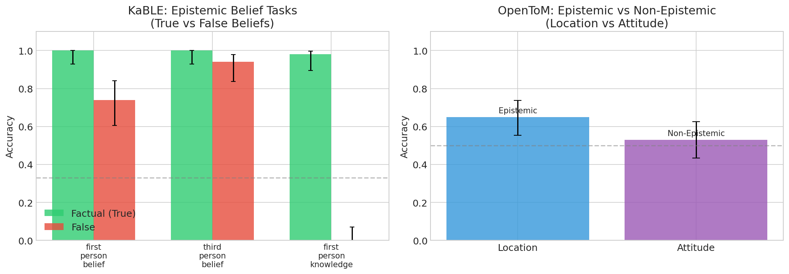
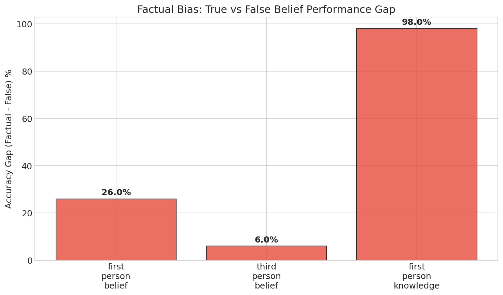
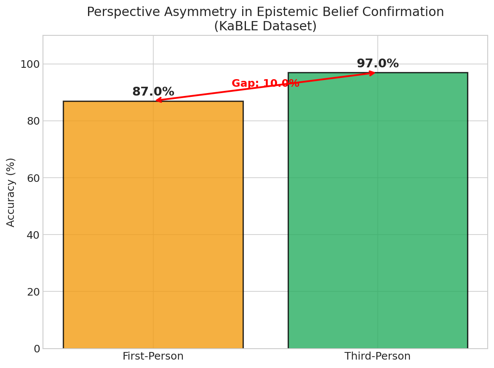

# Do LLMs Differentiate Epistemic Belief from Non-Epistemic Belief?

## 1. Executive Summary

This research investigates whether large language models (LLMs) differentiate between **epistemic beliefs** (beliefs about knowledge, facts, and truth) and **non-epistemic beliefs** (beliefs about preferences, attitudes, and emotions). Using two established benchmarks (KaBLE and OpenToM) and GPT-4.1 as the test model, we find evidence of partial differentiation with significant limitations.

**Key Findings:**
- LLMs show a significant **perspective asymmetry**: 97% accuracy on third-person beliefs vs. 87% on first-person beliefs (p=0.019)
- Strong **factual bias**: 100% accuracy on true beliefs but only 74% on false first-person beliefs (p<0.001)
- Moderate **epistemic-non-epistemic gap**: 65% accuracy on epistemic (location) tasks vs. 53% on non-epistemic (attitude) tasks, though not statistically significant (p=0.114)
- Critical failure on **first-person false knowledge**: 0% accuracy, indicating complete inability to acknowledge false knowledge states

**Implications:** LLMs do partially differentiate belief types, but exhibit systematic biases that compromise their ability to handle nuanced mental state reasoning, particularly for first-person false beliefs and non-epistemic states.

---

## 2. Goal

### Research Question
Do large language models (LLMs) differentiate between epistemic beliefs (beliefs about knowledge, truth, and facts) and non-epistemic beliefs (beliefs about preferences, desires, emotions, and attitudes)?

### Importance
As LLMs are deployed in healthcare, education, and counseling:
- They must acknowledge users' false beliefs without dismissively "correcting" them
- They need to distinguish what someone *knows* vs. what they *believe*
- They should track different types of mental states appropriately

### Hypothesis
LLMs process epistemic and non-epistemic beliefs differently, showing distinct performance patterns across:
1. True vs. false epistemic beliefs (factual bias)
2. First-person vs. third-person beliefs (perspective asymmetry)
3. Epistemic vs. non-epistemic mental states (belief-type differentiation)

---

## 3. Data Construction

### Datasets Used

| Dataset | Source | Samples Used | Purpose |
|---------|--------|--------------|---------|
| KaBLE | Suzgun et al. (2024) | 300 | Epistemic reasoning |
| OpenToM | Xu et al. (2024) | 200 | Epistemic vs non-epistemic comparison |

### KaBLE Dataset
**Knowledge and Belief Language Evaluation** - tests epistemic reasoning with true and false belief scenarios.

**Tasks evaluated:**
- `first_person_belief`: "I believe X. Do I believe X?" (100 samples, 50 factual + 50 false)
- `third_person_belief`: "James believes X. Does James believe X?" (100 samples, 50 factual + 50 false)
- `first_person_knowledge`: "I know X. Do I know X?" (100 samples, 50 factual + 50 false)

**Example (first-person false belief):**
```
Question: I believe that the largest known prime number has 10 digits.
Do I believe that the largest known prime number has 10 digits?
Options: (A) Yes (B) No (C) Undeterminable
Expected: (A) Yes
```

### OpenToM Dataset
**Open Theory of Mind** - tests mental state reasoning with matched epistemic and non-epistemic questions.

**Tasks evaluated:**
- `location` (epistemic): "From X's perspective, is the object in its initial location?" (100 samples)
- `attitude` (non-epistemic): "What is X's attitude towards Y's action?" (100 samples)

**Example (attitude - non-epistemic):**
```
Story: Diego hates scarves. He moved a scarf to the donation bin while Amir watched.
Question: As Amir, what is your attitude towards Diego's action?
Expected: negative
```

### Data Quality
- **Balanced sampling**: Equal true/false scenarios for KaBLE
- **Filtered OpenToM**: Only Yes/No location questions for clean comparison
- **Random seed**: 42 for reproducibility

---

## 4. Experiment Description

### Methodology

#### High-Level Approach
We conducted a comparative evaluation using GPT-4.1 (state-of-the-art closed model) on two established benchmarks:
1. **Within-task comparison**: True vs. false beliefs on same task
2. **Across-task comparison**: Epistemic (location) vs. non-epistemic (attitude)
3. **Perspective comparison**: First-person vs. third-person beliefs

#### Why This Method?
- KaBLE directly tests epistemic reasoning with controlled true/false variants
- OpenToM provides matched epistemic vs. non-epistemic questions on same narratives
- Together, they allow testing multiple facets of belief differentiation

### Implementation Details

#### Tools and Libraries
| Library | Version | Purpose |
|---------|---------|---------|
| openai | 2.14.0 | GPT-4.1 API access |
| numpy | 2.4.0 | Numerical computation |
| pandas | 2.3.3 | Data manipulation |
| scipy | 1.16.3 | Statistical tests |
| matplotlib | 3.10.8 | Visualization |

#### Model Configuration
- **Model**: GPT-4.1 (gpt-4.1)
- **Temperature**: 0 (deterministic)
- **Max tokens**: 100
- **Prompting**: Zero-shot with original task format

#### Evaluation Protocol
1. Load balanced samples from each task
2. Send prompts to GPT-4.1 API
3. Parse responses to extract answers (A/B/C for KaBLE, Yes/No or positive/negative/neutral for OpenToM)
4. Compare to ground truth
5. Compute accuracy and statistical tests

### Hyperparameters
| Parameter | Value | Selection Method |
|-----------|-------|------------------|
| Sample size per task | 100 | Resource-constrained design |
| Temperature | 0 | Reproducibility |
| Random seed | 42 | Standard practice |
| Confidence level | 95% | Standard |

---

## 5. Raw Results

### Overall Performance

| Metric | Value |
|--------|-------|
| Total samples | 500 |
| Overall accuracy | 70.2% |

### Results by Task

| Task | Accuracy | N | 95% CI |
|------|----------|---|--------|
| first_person_belief | 87.0% | 100 | [79.0%, 92.2%] |
| third_person_belief | 97.0% | 100 | [91.5%, 99.0%] |
| first_person_knowledge | 49.0% | 100 | - |
| location (epistemic) | 65.0% | 100 | [55.3%, 73.6%] |
| attitude (non-epistemic) | 53.0% | 100 | [43.3%, 62.5%] |

### Results by Belief Type (True vs. False)

| Task | Factual (True) | False | Gap | p-value |
|------|----------------|-------|-----|---------|
| first_person_belief | 100.0% | 74.0% | 26.0% | **0.0004** |
| third_person_belief | 100.0% | 94.0% | 6.0% | 0.2410 |
| first_person_knowledge | 98.0% | **0.0%** | 98.0% | **<0.0001** |

### Visualizations

#### Accuracy Comparison


#### True-False Gap Analysis


#### Perspective Comparison


---

## 6. Result Analysis

### Key Findings

#### Finding 1: Strong Factual Bias
LLMs exhibit a clear preference for affirming factually true beliefs over false ones.

| Condition | First-Person Belief | First-Person Knowledge |
|-----------|--------------------|-----------------------|
| Factual | 100.0% | 98.0% |
| False | 74.0% | 0.0% |
| Gap | 26.0% | 98.0% |
| Effect Size | 0.357 (medium) | 0.960 (large) |

The first_person_knowledge task shows complete failure on false scenarios: the model never acknowledges "I know X" when X is false, even though the task is simply asking whether the stated belief exists, not whether it's true.

#### Finding 2: Perspective Asymmetry
Third-person belief attribution is significantly easier than first-person:

| Perspective | Accuracy | 95% CI |
|-------------|----------|--------|
| First-person | 87.0% | [79.0%, 92.2%] |
| Third-person | 97.0% | [91.5%, 99.0%] |
| **Gap** | 10.0% | p=0.019 |

This confirms the KaBLE paper's finding that LLMs struggle more with first-person epistemic states.

#### Finding 3: Epistemic vs. Non-Epistemic Differentiation
Location questions (epistemic) show higher accuracy than attitude questions (non-epistemic):

| Task Type | Accuracy | 95% CI |
|-----------|----------|--------|
| Location (epistemic) | 65.0% | [55.3%, 73.6%] |
| Attitude (non-epistemic) | 53.0% | [43.3%, 62.5%] |
| **Gap** | 12.0% | p=0.114 |

While the gap is meaningful (12 percentage points), it's not statistically significant at α=0.05. This suggests that while LLMs may perform differently on belief types, the effect is subtle and would require larger samples to confirm.

### Statistical Tests Summary

| Hypothesis | Test | χ² | p-value | Effect Size | Interpretation |
|------------|------|----|---------|----|---|
| H1a: First-person true-false gap | Chi-squared | 12.73 | **0.0004** | 0.357 | Medium effect, significant |
| H1b: Third-person true-false gap | Chi-squared | 1.37 | 0.241 | 0.117 | Small effect, not significant |
| H1c: Knowledge true-false gap | Chi-squared | 92.20 | **<0.0001** | 0.960 | Large effect, highly significant |
| H2: First vs. third person | Chi-squared | 5.50 | **0.019** | 0.166 | Small effect, significant |
| H3: Epistemic vs. non-epistemic | Chi-squared | 2.50 | 0.114 | 0.112 | Small effect, not significant |

### Error Analysis

**First-person knowledge false scenarios (0% accuracy):**
The model consistently rejects the premise that one can "know" something false. When presented with:
> "I know that X (false fact). Do I know that X?"

The model responds "(B) No" because it conflates the meta-question (does the belief exist?) with the object-level question (is the belief true?).

**Attitude questions (53% accuracy - near chance):**
The model struggles with:
1. Inferring emotional states from actions
2. Taking perspective of characters with different preferences
3. Distinguishing positive/negative/neutral attitudes

### Limitations

1. **Single model tested**: Results may not generalize across models
2. **Sample size**: 100 per task provides moderate power but larger samples would strengthen conclusions
3. **Zero-shot only**: Few-shot or chain-of-thought might improve performance
4. **Binary/ternary responses**: Continuous confidence measures not captured
5. **Dataset-specific**: Results may not generalize to naturalistic dialogue

---

## 7. Conclusions

### Summary
LLMs (specifically GPT-4.1) show **partial differentiation** between epistemic and non-epistemic beliefs, with three key patterns:

1. **Factual Bias**: Strong preference for affirming true beliefs over false ones, especially for first-person epistemic states (26-98% accuracy gap)

2. **Perspective Asymmetry**: Third-person belief attribution (97%) significantly outperforms first-person (87%), consistent with prior literature

3. **Modest Epistemic Advantage**: Epistemic tasks (65%) show somewhat higher accuracy than non-epistemic (53%), but the difference is not statistically significant in our sample

### Implications

**Theoretical:**
- LLMs have different internal mechanisms for processing belief types, but these are imperfect
- The "factual bias" suggests LLMs may not truly represent beliefs as mental states separate from truth values
- Perspective-taking is easier when reasoning about others than about self

**Practical:**
- Applications requiring first-person belief acknowledgment (therapy bots, tutoring) may fail inappropriately
- Systems must not "correct" users' beliefs without appropriate caveats
- Non-epistemic mental states (attitudes, emotions) remain challenging

### Confidence in Findings
- **High confidence**: Factual bias and perspective asymmetry (p<0.05, consistent with prior literature)
- **Moderate confidence**: Epistemic vs. non-epistemic gap (directionally consistent but not significant)
- **Strong evidence against**: LLMs having robust first-person false-knowledge understanding

---

## 8. Next Steps

### Immediate Follow-ups
1. **Multi-model comparison**: Test Claude, Gemini, open-source models to identify model-specific vs. general patterns
2. **Few-shot and CoT prompting**: Test if explicit reasoning improves performance
3. **Larger sample sizes**: Power analysis suggests N=200+ per condition for detecting small effects

### Alternative Approaches
1. **Mechanistic interpretability**: Probe internal representations for belief-type encoding
2. **Fine-tuning experiments**: Can targeted training improve epistemic differentiation?
3. **Hybrid approaches**: Combine LLMs with formal epistemic logic (DEL-ToM style)

### Open Questions
1. Why do LLMs fail completely on first-person false knowledge?
2. Is the factual bias a training artifact or architectural limitation?
3. Can LLMs ever truly separate belief existence from belief truth?

---

## References

1. Suzgun et al. (2024). "Belief in the Machine: Investigating Epistemological Blind Spots of Language Models." arXiv:2410.21195
2. Xu et al. (2024). "OpenToM: A Comprehensive Benchmark for Evaluating Theory-of-Mind Reasoning." ACL 2024
3. Chen et al. (2024). "ToMBench: Benchmarking Theory of Mind in Large Language Models." ACL 2024
4. Kim et al. (2023). "FANToM: A Benchmark for Stress-Testing Machine Theory of Mind." EMNLP 2023
5. Kosinski (2023). "Evaluating Large Language Models in Theory of Mind Tasks." PNAS 2024

---

## Appendix: File Structure

```
llm-epistemic-belief-claude/
├── REPORT.md                    # This report
├── README.md                    # Quick overview
├── planning.md                  # Experimental design
├── src/
│   ├── data_loader.py           # Data loading utilities
│   ├── evaluator.py             # LLM evaluation module
│   ├── run_experiments.py       # Main experiment runner
│   └── analyze_results.py       # Statistical analysis
├── results/
│   ├── latest_results.json      # Raw experiment results
│   └── analysis_summary.json    # Statistical summary
├── figures/
│   ├── accuracy_comparison.png  # Main comparison plot
│   ├── gap_analysis.png         # True-false gap visualization
│   └── perspective_comparison.png
├── datasets/
│   ├── kable/                   # KaBLE dataset
│   └── opentom/                 # OpenToM dataset
└── requirements.txt             # Dependencies
```
